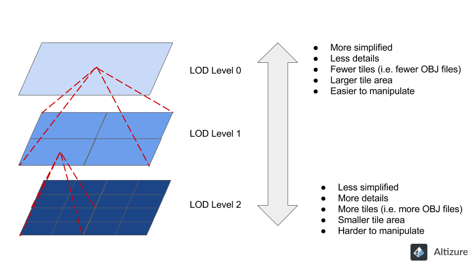
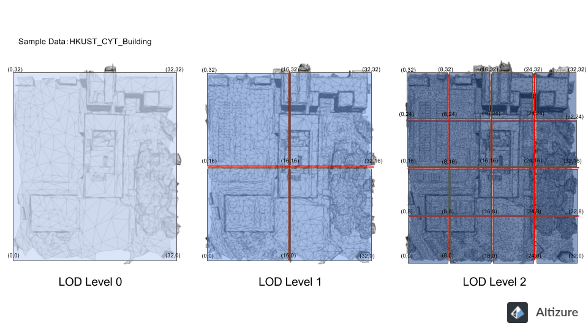

# Downloadable Assets

**Downloadable Assets are only available for Professional projects.** You can convert a Free project into a Pro and download your model.

You can download the raw 3D models in OBJ format. Besides, you can convert the OBJ files into other formats by using the Offline Format Converter in [Altizure Desktop](https://www.altizure.com/download). Please find the tutorial for Format Converter [here](offline-format-converter.md).

The formats that you can convert the OBJ files into include PLY, OSGB, KML, DAE, STL, orthomap, etc. You can download the free sample assets of obj files, orthomap, elevation map \(DSM\) and Google Earth 3D model at the [**bottom**](#sample) of this page.

* [There are lots of OBJ files inside model.zip. Why is that? Which one is my model?](#lots)
* [How do I determine which part of the model does each OBJ represent?](#lod)
* [OBJ model viewers](#viewer)
* [Why are my download assets different from the content described on this page?](#different)
* [Sample of Altizure 3D models](#sample)

## There are lots of OBJ files inside model.zip. Why is that? Which one is my model? {#lots}

Our 3D reconstruction engine is tuned to generate high quality 3D models from images. However, high quality also means huge data size and this put great pressure on lower end computers and devices when they need to handle one, for example, in transferring over internet, in editing the 3D models or in rendering and etc. To tackle the problem, we have employed a technique called **level-of-detail \(LOD\)** to systematically simplify and break down large 3D models into smaller pieces which we call **tiles** and organize them in a **quadtree** structure. This technique allows our engine to handle large scale 3D models more conveniently and offers you a greater flexibility in handling the models as you can choose a comfortable level-of-details model to work with according to your constraints and needs.

Quadtree structure:

Example:

 

**In conclusion, each OBJ file in model.zip represents a particular tile of your model at certain level-of-detail**. You can get the complete model after you have loaded all the tiles at the same level together into your software.

## How do I determine which part of the model does each OBJ represent? {#lod}

Every OBJ file is named with 3 numbers. Take the file “tile\_1\_0\_16.obj” as an example. The first number \(i.e. 1\) represents the level-of-detail \(LOD\). **The smaller the number, the more simplified is the model.** The second and third number \(i.e. 0, 16\) represent its x-y location in the model respectively.

Example:

Since the tiles are organized in quadtree structure, every step up in LOD will bring 4 times more number of tiles. Tile area will also shrink by 4 times and its length will shrink by half accordingly. Therefore, the step interval in second and third number will shrink by half as well. This process repeats until it reaches the highest LOD. By then each tile cannot be further broken down and we define its length as 1 unit.

Take our sample data, HKUST\_CYT\_Building, as an example. This dataset has highest LOD at level 5. Therefore, it has 2^5 = 32 tiles in both x and y direction at LOD5 and as such we says the model has a size of 32 times 32 unit large.

In LOD level 5, the most detail level is reached and each tile has a length of **1** unit. Therefore:  
`tile_5_1_0.obj`is right next to`tile_5_0_0.obj`. The x coordinate is jumped by **1** unit.  
`tile_5_0_1.obj`is right above`tile_5_0_0.obj`. The y coordinate is jumped by **1** unit.

In LOD level 4, each tile has a length of **2** unit. Therefore:  
`tile_4_2_0.obj`is right next to`tile_4_0_0.obj`. The x coordinate is jumped by **2** unit.  
`tile_4_0_2.obj`is right above`tile_5_0_0.obj`. The y coordinate is jumped by **2** unit.

In LOD level 3, each tile has a length of **4** unit. Therefore:  
`tile_3_4_0.obj`is right next to`tile_3_0_0.obj`. The x coordinate is jumped by**4**unit.  
`tile_3_0_4.obj`is right above`tile_3_0_0.obj`. The y coordinate is jumped by**4**unit.

In LOD level 2, each tile has a length of **8** unit. Therefore:  
`tile_2_8_0.obj`is right next to`tile_2_0_0.obj`. The x coordinate is jumped by**8**unit.  
`tile_2_0_8.obj`is right above`tile_2_0_0.obj`. The y coordinate is jumped by**8**unit.

In LOD level 1, each tile has a length of **16** unit. Therefore:  
`tile_1_16_0.obj`is right next to`tile_1_0_0.obj`. The x coordinate is jumped by **16** unit.  
`tile_1_0_16.obj`is right above`tile_1_0_0.obj`. The y coordinate is jumped by **16** unit.

In LOD level 0, each tile has a length of **32** unit and is as large as the model.  
Therefore it has only one`tile_0_0_0.obj`file.

## How to view 3D models in OBJ format? {#viewer}

Here is an incomplete list of both free and professional softwares that read OBJ file:

**Free**:

1. Autodesk FBX Review:
   [Product Page](http://www.autodesk.com/products/fbx/fbx-review)

**Professional**:

1. Adob​​​​e Photoshop:
   [Product Page](https://www.adobe.com/products/photoshop.html)
2. Autodesk 3Ds Max:
   [Product Page](https://www.autodesk.com/products/3ds-max/overview)
3. Autodesk Maya:
   [Product Page](http://www.autodesk.com/products/maya/overview)
4. Blender \(opensource\):
   [Product Page](https://www.blender.org/)
5. Unity:
   [Product Page](https://store.unity.com/?_ga=1.1178609.1753436748.1473386856)

## Why are my download assets different from the content described on this page? {#different}

We are constantly improving our engine and providing more and more downloadable assets. If your project is reconstructed in early times, the download assets in your project may not be up-to-date. In this case, please contact us by clicking the **Report Problem** button on the **Overview** page. We will arrange a free update to you after confirming the problem.

## Sample {#sample}

Below are the sample downloadable assets from [Cheng Yu Tung Building](https://www.altizure.com/project/5a08601a5d1dfe17d0c76ab1/model) and some other file formats that can be generated by Converter. Please feel free to download and test these samples. If you have any question, please contact us in the forum or support@altizure.com.

**Online result:**

<iframe src="https://site.altizure.com/project/590c784c1225725be9d360db/model/embed#autoplay=false" style="border:none;width:640px;height:480px"></iframe>

**Downloadable Asset:**

* 3D models \(model.zip\):
  [Download from Google Drive](https://drive.google.com/file/d/1k68Ih25i7G1PPJ94f1VOmWAuk2mCKdv6/view)

The following formats can be obtained by using [Altizure Offline Format Converter](https://site.altizure.com/support/articles/format_conversion):

* Orthomap \(ortho.zip\):
  [Download from Google Drive](https://drive.google.com/file/d/1UU82tWACv00c_vU3nG7kxS-nzOkscy8m/view?usp=sharing)
* Elevation map \(DSM\) \(ortho\_dsm.zip\):
  [Download from Google Drive](https://drive.google.com/file/d/1CmTtuWPo9OZXL5KgewSP9SaxUzeIl6Hb/view?usp=sharing)
* 3D models \(merged\_model.zip\):
  [Download from Google Drive](https://drive.google.com/file/d/1xzWAcoAoENvFwNmMuz9425TWOiVv6uq5/view?usp=sharing)
* Google Earth 3D model \(model.kmz\):
  [Download from Google Drive](https://drive.google.com/file/d/1uQqTq4S_y85AZahjJp9mFH7EAQhCY6pk/view?usp=sharing)

---

Last modified at {{ file.mtime }}
