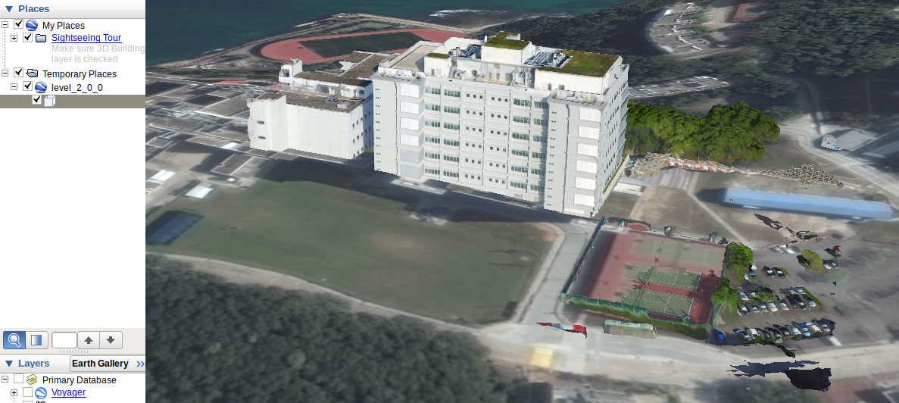
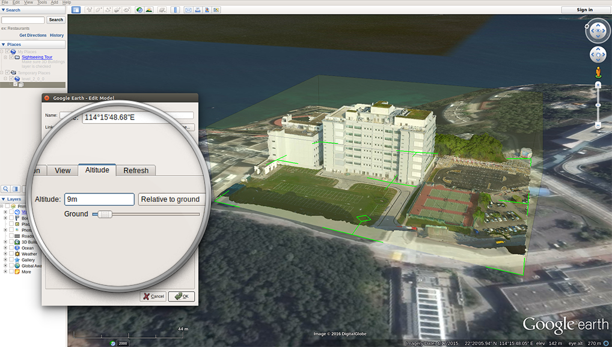

# Import Altizure Model into Google Earth

* [Import orthomap or dsm](#ortho-dsm)
* [Import 3D models](#3d)
* [Load KMZ file in slow speed](#slow)

## How to upload orthomap/dsm to Google Earth? {#ortho-dsm}

You can use this feature if you meet the following conditions:

* the input images contain GPS information
* the alignment of 3D reconstruction and GPS is successful.

A step-by-step guide:

1. Download Google Earth Pro [here](http://www.google.com/earth/). Please download the pro version instead of the normal Google Earth. And Google Earth Pro is free at the moment.
2. Convert your downloaded files to orthomap/dsm by using our Offline Converter in [Altizure Desktop](https://www.altizure.com/desktop).
3. Open Google Earth Pro.
4. Go to`File`&gt;&gt;`Import`and select the downloaded tif files. Then the viewpoint will fly to the geographical location of your model. Choose`scale`to upload your orthomap on Google Earth Pro.

## How to import 3D models into Google Earth? {#3d}

You can use this feature if you meet the following conditions:

* the input images contain GPS information
* the alignment of 3D reconstruction and GPS is successful.

Please obtain the`DAE`and`KML`files by using our Offline Converter in [Altizure Desktop](https://www.altizure.com/desktop). To display your 3D model, you can directly upload these files to Google Earth.

`DAE`files contain the geometry information of your models. By importing them, Google Earth will place your models in the current viewing location.

`KML`files contain additional GPS information. By importing them, Google Earth will place your models according to its GPS location.

To import them:

1. Open Google Earth Pro.
2. Go to`File`&gt;&gt;`Open`and select the downloaded `DAE`or`KML`files. In the following example, we imported the `level_2_0_0.kml` file.

You may notice that the models sometimes sink below the Google Earth terrain surface. This is due to the lack of altitude information in GPS. You can fix it by manually adjusting the altitude.

To adjust altitude:

1. Expand the imported KML files in the sidebar \(in left-hand side\)
2. Right click on the model icon
3. Select **Properties** and go to **Altitude** tab
4. Adjust the altitude to your needs and confirm

_At the moment, we only provide kml and dae output up to level 5 because Google Earth cannot load higher resolution models in one batch._

## The loading speed of KMZ file is very slow in Google Earth. Some tiles are even missing. What happened? {#slow}

KMZ is in fact a zipped format. Therefore Google Earth will have to unzip it on the fly tiles are loaded. We suggest unzipping the KMZ file like a normal .zip file before importing into Google Earth. After unzipping you can import the Project\_LOD.kml file.

---

Last modified at {{ file.mtime }}
