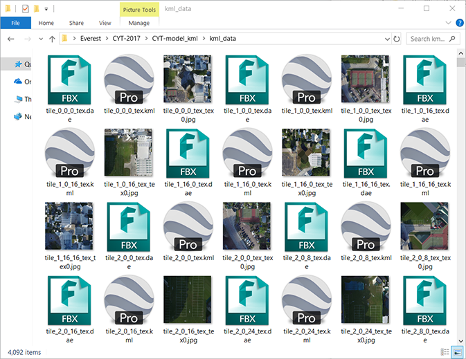
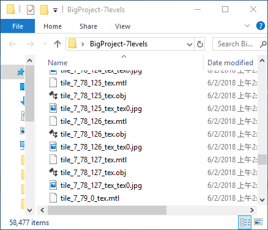

# How to import Altizure models into SketchUp？

* [Files needed for importing Altizure models](#need)
* [How to import Altizure DAE files](#full-dae)
* [How about obtaining DAE files by using "Full project OBJ files&gt;kml"?](#full-kml)
* [Slow rendering in SketchUp](#slow)
* [Import models with a high level-of-detail in SketchUp](#high-lod)

## To import a file into SketchUp, you need {#need}

1. Free Offline Format Converter in [Altizure Desktop](https://www.altizure.com/desktop). 
   * [Tutorial on Format Converter](https://kitty_ji.gitbooks.io/eng-altizure-reconstruction-guide/content/offline-format-converter.html)
2. SketchUp [Download](https://www.sketchup.com/)
3. [Sample of the downloadable assets](https://kitty_ji.gitbooks.io/eng-altizure-reconstruction-guide/content/downloadable-assets.html#sample)

## How to import Altizure DAE files into SketchUp? {#full-dae}

The 3D model available to download at altizure.com uses .obj filename extension. Please watch the short tutorial or follow the steps below and convert your 3D models into DAE format.

**（插入视频）**

**Step 1:** Merge the .obj files. Go to **Altizure Desktop &gt; Converter** and select **Full project obj files &gt; merge**.

All the .obj tiles[at the same level of textures](https://site.altizure.com/support/articles/download_assets?lang=en)will be merged into one file. Take the example of a model in LOD level 5. If you set the Block Size as the default number 32, you will export 5 .obj files with each representing a particular level of textures.

**Please notice:** .jpg files are the textures of model. They must be in the same folder together with other files of different formats.

**Step 2:** Choose the level of model that your computer can process. Go to **Single obj file &gt; dae**, and convert the selected .obj model.

**Step 3: **Open SketchUp. Click **File &gt; Import**. In the pop-up window, locate and select the .dae file for import.

Please remember to choose **COLLADA Files \(\*.dae\) **in the **Files of Type **drop-down list on the bottom right corner of the dialog box.

**Step 4: **After loading the .dae file, you may find that the model is not displayed in high resolution. By default, SketchUp downgrades higher resolution image textures to a maximum of 1024 x 1024 pixels.

If you want to turn off this feature, you can go to **Window &gt; Preferences &gt; OpenGL **in Windows system. Check the box **Use maximum texture size **and click **OK**. In this way, you are telling SketchUp not to downgrade your model to 1024 pixels. For macOS users, please find this option in **Properties &gt; OpenGL**.

**Important! **By unchecking this option, the size of your image textures will have a sharp increase, severely testing your graphics card and system memory. So, please be cautious about the texture size. You can keep it unchanged if you do not have a high-performance video card.

**Step 5: **By defult, the edges of a model would be visible in SketchUp. To hide them, you can go to **Style &gt; Edit &gt; Edge Settings **on the right panel. Uncheck **Edges **and **Profiles **to hide the lines.

## Can I obtain .dae files by using Full project OBJ files &gt; kml? {#full-kml}

In essence, this is okay because the output .kml folder includes the files in DAE format. \(Below is a screenshot of the .kml folder.\)

However, the biggest disadvantage of this method is that there are too many .dae files in the kml. folder. Why? Because the input data includes numerous .obj tiles, which will all be converted into .dae if you adopt this method. And it's quite time-consuming to load all .dae data in SketchUp.

## SketchUp rendering is painfully slow. How can I speed it up? {#slow}

The slow rendering might be due to the power limit of your Graphics Card. You can try to lower the resolution of textures. Through our tests, we find that NVIDIA GTX 980 can load models of LOD level 6 smoothly.

## How to import models with a high level-of-detail in SketchUp? {#high-lod}

[The concept of LOD level or high-level textures](https://site.altizure.com/support/articles/download_assets#there)

In short, the whole process can be summarized as: **Merge the OBJ files &gt; Convert OBJ to DAE &gt; Import**

**Step 1: **Go to **Altizure Desktop &gt; Converter &gt; Full obj project &gt; merge**.

If you want to merge the tiles at level 6 or above, we recommend that the Block Size should be 64— which is the highest that a computer can support. To further explain it, we use a model of LOD level 7. As we have illustrated in [another article](https://site.altizure.com/support/articles/format_conversion#biggest), the model should have 128x128 tiles at level 7, i.e. 2^\(6+1\)=128. This means, there'll be 4 .obj files if you merge the tiles at level 7, i.e. \(128x128\)/\(64x64\)=4.

**Step 2: **Select **Single obj file &gt; dae**. Please make sure that each .dae file you generate has a different name.

**Step 3: **Import .dae into SketchUp. After testing, NVIDIA GTX 980 can load all the 4 .dae files \(as shown below\).

---

Last modified at {{ file.mtime }}