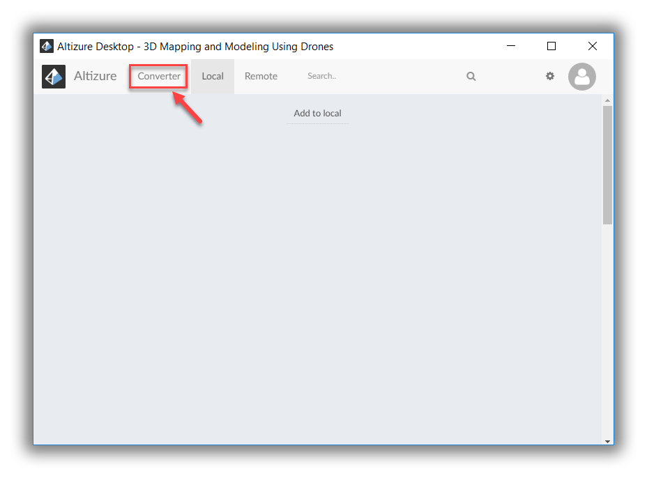
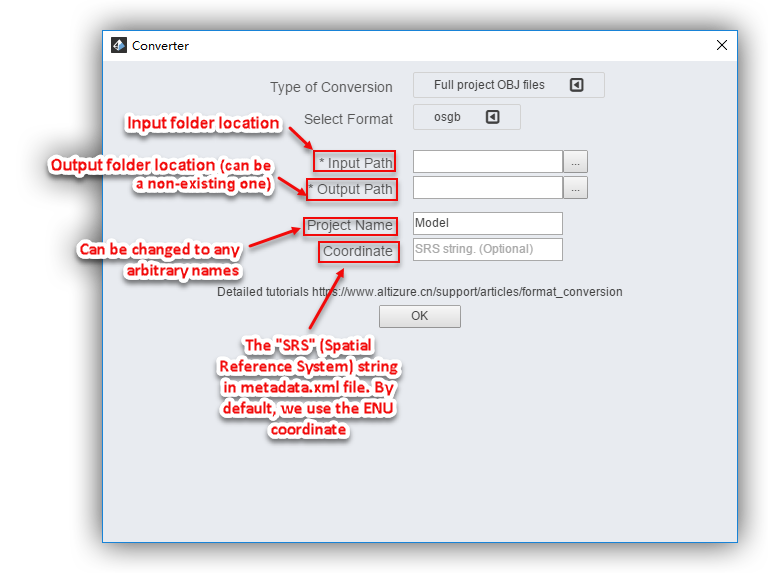
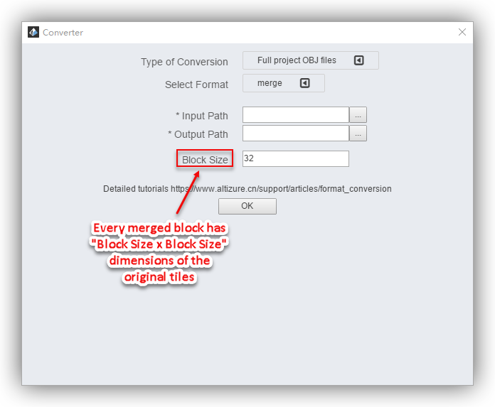
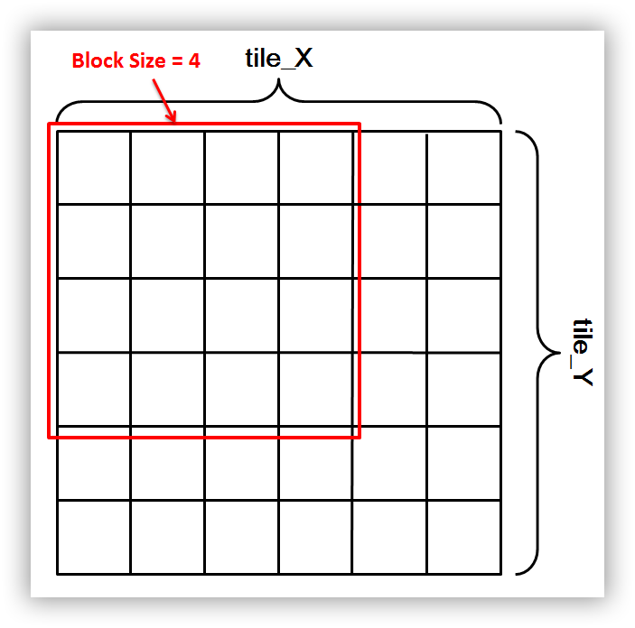
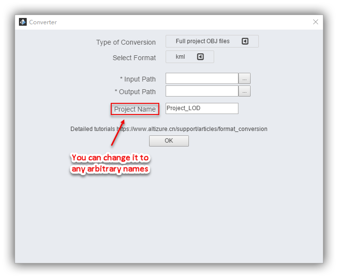
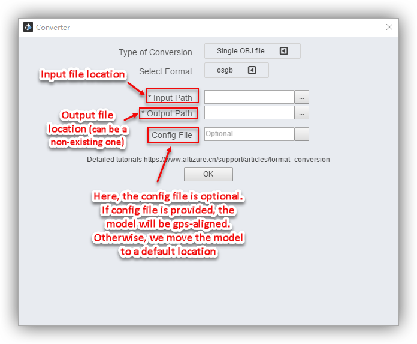
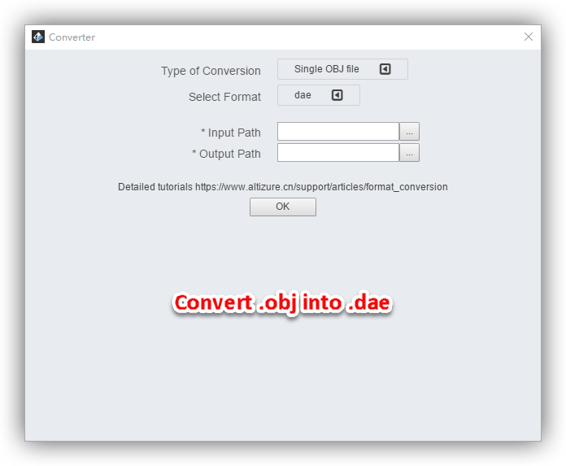
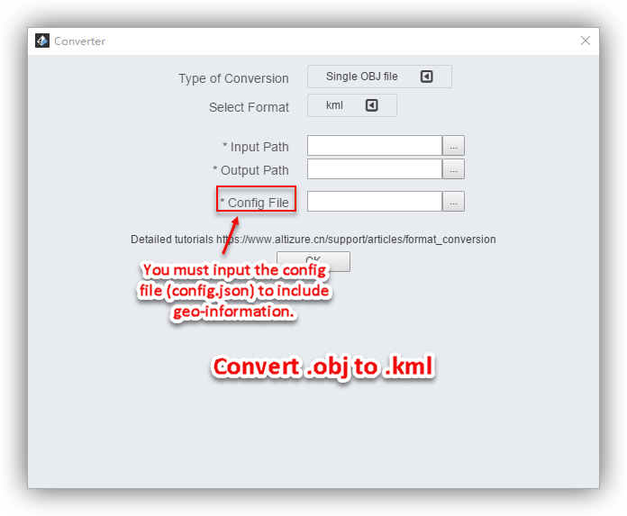
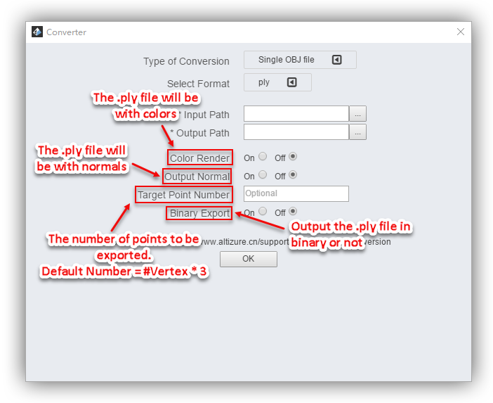

# Altizure Offline Format Converter

Altizure Converter is designed to suit the specific needs of each customer. It offers high quality, superfast and free conversion service that allows customers to smoothly convert the files into many other formats they want \(.osgb .dae .stl .kml .ply\).

* [Supported platforms](#platforms)
* [Who should read this article?](#who)
* [Where can I get the Converter?](#where)
* [Formats that be converted to](#formats)
* [Features of Altizure Converter](#features) 
  * [Input and output paths](#paths)
  * [Full project](#full)
    * [OSGB](#fullosgb) & [Orthomap](#fullortho) & [Merge](#fullmerge) & [KML](#fullkml)
  * [Single OBJ file](#single)
    * [OSGB](#singleosgb) & [DAE](#singledae) & [KML](#singlekml) & [STL](#singlestl) & [PLY](#singleply)
* [Where to download the input OBJ files?](#download)
* [Fix the d3dcompiler\_47.dll error](#error)

## Supported Platforms {#platforms}

* Windows \(64-bit\)
* macOS

## Who should read this article? {#who}

People who have specific needs of model format in their third party software for redevelopment. e.g. map surveying, animation or CAD.

## Where can I get the Converter? {#where}

The Offline Converter is now available for [Altizure Desktop](https://www.altizure.com/desktop) \(Windows 64-bit & macOS\).

## Formats that be converted to {#formats}

At the moment, Altizure users can use Offline Format Converter to convert .obj files into the following formats:

* **PLY file** is the abbreviation of Polygon File Format, which can store generic 3D model data. We use PLY format to store the point cloud \(i.e. point coordinates, colors and normals\) in the offline converter.

* **OSGB file** is the abbreviation of Open Scene Gragh Binary, widely used by professionals in fields like photogrammetry and map surveying. It is a binary representation of the model with all textures contained within one standalone file.

* **DAE file** is also called COLLAborative Design Activity, a commonly-seen 3D file format. COLLADA is an XML-based schema that enables you to transfer data among 3D digital content creation tools.

* **KML file** is a 3D file format that includes geographic information, and can be loaded to Google Earth.

* **STL files** describe the surface geometry of a 3D object without any representation of color, texture or other common CAD model attributes. It is widely used for 3D printing or prototyping.

## Features of Altizure Converter {#features}

### Input and Output Paths {#paths}

For "Full OBJ Project" conversion, the **Input Path** should be the full path of the project folder that you want to convert. You should select the input path of the folder where you put all your OBJ files. Normally, the input folder will be the folder that you unzip from "model.zip" downloaded from Altizure. As for **Output Path**, it is the full path of the folder to which you want to export files. This could be either an existing folder or a non-existing one that the software will then automatically create.

In another word, for "Full OBJ Project" conversion, both the Input and output paths should end with a folder, instead of a file.

**Please notice: **At the moment, Altizure Format Converter only supports the Input Path and Output Path in English. It would be better for users to name all the folders in English letters as well as numeric and special characters.

Example: for **Full project OBJ files &gt; Orthomap**

The Input Path could be **C:\Users\Altizure\Desktop\CYT model-2017**

The Output Path could be **C:\Users\Altizure\Desktop\CYT-Ortho**

This means, **CYT model-2017 **is the input folder, while **CYT-Ortho** is the output folder.

However, if you just want to convert a single OBJ file, you need to select the specific file that you want to convert in the Input Path. While for the Output Path, you can select an export folder and the computer will automatically generate the name of the export file.

Example: for **Single OBJ file &gt; DAE**

The Input Path could be **C:\Users\Altizure\Desktop\CYT model-2017\tile\_0\_0\_0\_tex.obj**

The Output Path could be **C:\Users\Altizure\Desktop\output.dae**

Here in this case, **C:\Users\Altizure\Desktop** is the folder path that you select, while **output.dae** is the default name of the export file that Altizure Desktop automatically generates. You can rename the export file if you want, e.g. you can change it to **C:\Users\Altizure\Desktop\Sketchup-output-1.dae** or anything else.

### Type of Conversion: Full project {#full}

A whole project/ a bunch of .obj files can be converted into:

#### Select Type: OSGB {#fullosgb}

#### Select Type: Orthomap {#fullortho}

##### Maximum Resolution & Keep Original Resolution: {#max}

These two options affect each other.\_Maximum Resolution\_means that the maximum resolution of the output map should never exceed the value \(default = 16384\). The reason for such constraint is that for extremely big projects, it’s impossible to store a large orthomap/DSM into just one file \(like city-scale project\). So here in this case, you have two choices:

One is to lower the resolution of the orthomap/DSM so as to keep the file below the maximum resolution that you set. In another word, uncheck\_Keep Original Resolution\_and keep\_Maximum Resolution\_as default \(or type in a desired value\).

The second is to\_Keep Original Resolution\_and the software will automatically cut the original orthomap/DSM into several small pieces, with each piece under the maximum limit.

##### Why the maximum resolution is 16384 in default? {#16384}

Before we explain why we set the maximum resolution as 16384, you need to first understand the concept of LOD and tile. [(Article 1)](downloadable-assets#lots) & [(Article 2)](downloadable-assets#lod)

The image resolution for each tile is 512x512 pixels. As the OBJ file at LOD level 5 has 32 tiles on each side, we set the Maximum Resolution at 16384x16384 \(because 512x32=16384\). In this way, for the models at LOD level 5 or below, Altizure Converter can generate an orthomap in its original resolution.

#### Select Type: Merge {#fullmerge}

Literally speaking, **Merge** simply means to merge a bunch of .obj files into one big .obj file. But there is much more.

  

To understand the **Merge** function, you must first understand [the quadtree structure](https://kitty_ji.gitbooks.io/eng-altizure-reconstruction-guide/content/downloadable-assets.html#lots) and [the OBJ file naming principle in model.zip](https://kitty_ji.gitbooks.io/eng-altizure-reconstruction-guide/content/downloadable-assets.html#lod).

If you set the block size as 32 \(which is the default block size\), the Format Converter will **merely merge** the OBJ files in model.zip for every 32 by 32 unit area, and then generate the merged OBJ files. You can roughly view them as a larger piece of tile. They still maintain LOD but no longer are in the quadtree structure. The purpose of it is to offer users a more handy control over their models as they do not have to import a large number of fragmented pieces into software everytime.

##### What is the biggest Block Size that I can set?

After reading the articles on [quadtree structure](https://kitty_ji.gitbooks.io/eng-altizure-reconstruction-guide/content/downloadable-assets.html#lots) and [LOD](https://kitty_ji.gitbooks.io/eng-altizure-reconstruction-guide/content/downloadable-assets.html#lod), you may now understand, the OBJ files that Altizure generates are named as tile\_I\_x\_y. The first number \(i.e. I\) represents the level-of-detail \(LOD\). The second and third number \(i.e. x, y\) represent its x-y location in the model respectively.

At level I, the maximum number for x- and y-coordinates of each file should not exceed 2^\(l+1\). To explain it, let's take a Level-5 model as an example. For the files at LOD level 5, the x- and y-coordinates will not exceed 64 \(i.e. 2^\(5+1\)=64\). This means, if you want to merge all the OBJ files at level 5 into one OBJ, you can set the Block Size as 64, which is also the biggest Block Size that a computer can handle so far.

**Please notice: **Because of the RAM limit, it's difficult for the Converter to merge the OBJ files at high LOD levels into just one document. So, normally, in order to evenly cut the merged model into several pieces, we would recommend the ideal Block Size to be the power of 2 \(i.e. 2^\).

##### How about merging OBJ models with high LOD levels? {#high}

If you want to merge the tiles at level 6 or above, we recommend that the **Block Size** should be **64**— which is the highest that a computer can support. To further explain it, we use a model of LOD level 7. As we have illustrated above, the model should have 128x128 tiles at level 7, i.e. 2^\(6+1\)=128. This means, there'll be 4 .obj files if you merge the tiles at level 7, i.e. \(128x128\)/\(64x64\)=4.

#### Select Type: KML {#fullkml}

### Type of Conversion: Single OBJ file {#single}

A single .obj file can be converted into:

#### Select Type: OSGB {#singleosgb}

**Input Path: **The full path of the .obj file that you want to convert.

**Output Path: **The full path of the folder to which you want to export files. This could be either an existing folder or a non-existing one that the software will then automatically create.

#### Select Type: DAE {#singledae}

If you want to learn more about how to convert **a full OBJ project** into **DAE**, please take a look at [this article](https://kitty_ji.gitbooks.io/eng-altizure-reconstruction-guide/content/import-to-sketchup.html#full-dae).

#### **Select Type: KML** {#singlekml}

#### **Select Type: STL** {#singlestl}

#### **Select Type: PLY** {#singleply}

## Where to download the input OBJ files? {#download}

Upgrade to pro \(you need to buy some alticoins\), then download **&lt;projectname&gt;\_model.zip**. [\(Sample download files\)](https://kitty_ji.gitbooks.io/eng-altizure-reconstruction-guide/content/downloadable-assets.html#sample)

## How to fix the missing or corrupted d3dcompiler\_47.dll error when installing Altizure Desktop on Windows 7? {#error}

Please download and install **kb4019990 **from [this website](https://www.catalog.update.microsoft.com/Search.aspx?q=kb4019990).

.

