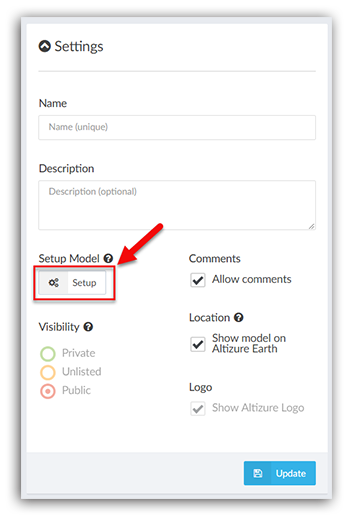
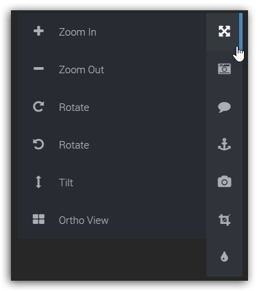
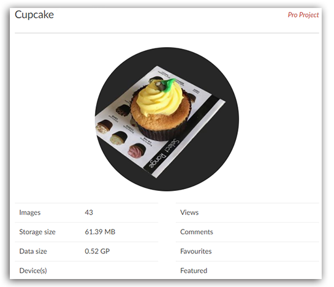

# Setup Page {#setup}

**Setup** page is a model viewer where the owner can perform model-related settings, including recalculating GPS alignment, adding annotations and setting initial view point. In some tutorials, the **Setup** Page will be referred to as **setting/setup mode**.

* [Viewing Angle icon](#viewingangle)
* [Set Thumbnail icon](#thumbnail)
* [Annotation icon](#annotation)
* [Model Orientation icon](#orientation)
* [Camera Settings icon](#camera)
* [Crop icon](#crop)
* [Water icon](#water)

### How to Enter the Setup Page

Please go to **My Projects **&gt;&gt;** **Select a project &gt;&gt; Find the **Settings card **on the **Overview** page &gt;&gt; Click **Setup** &gt;&gt; Enter the **setting mode **of this project.

## Viewing Angle Icon {#viewingangle}

This function is the same as the **Viewing Angle** icon in the **Studio** page. As you can see on the tab, you can zoom in/out, rotate or tilt the model. You can also view the model by using your computer mouse, e.g. scroll your mouse wheel to zoom in/out, left-click to drag your model left or right, right-click to rotate/tilt your model.

**But plese be aware** that if you click **Ortho View**, you will have a 2D orthomap instead of viewing the model from the top.

## Set Thumbnail Icon {#thumbnail}

To take a nice thumbnail image, you can follow the steps below:

1. Navigate to a view point which presents the best view of your 3D model.
2. Click **Set Thumbnail** icon and the system will take a screenshot of your model.  
   

3. If you are satisfied with the image, click **Set Thumbnail **in the popup dialog and set the screenshot as the thumbnail of your model. Or, you can click **Cancel **and repeat the above steps to re-take a screenshot.  
   

The view point you choose for the thumbnail is also the starting view point of your project when your 3D model is viewed!

## Annotation Icon {#annotation}

Users can annotate on the model. An annotation is attached to a point on the 3D model, which moves when the model moves. Each annotation has its own symbol on the map, as well as a title and a description in which you can insert links and images.

Please read this [**guideline**](mark-or-tag.md) if you want to annotate.

## Model Orientation Icon {#orientation}

Sometimes, if the photos are not successfully aligned with GPS information, it's difficult for the machine to figure out whether the model is facing south or north. This would end up the model being upside down or not facing the right direction. So, you need to tell the computer what the right direction is by setting the **model orientation**. 

Please read this [**guideline**](orientation.md) if you want to learn how to set the model orientation.

## Camera Settings Icon {#camera}

You can change the preset value of camera viewing angles or viewing distance in this card. Please read this [**tutorial**](model-viewing.md) if you want to learn more.

## Crop Icon {#crop}

You can use the cropping tool to quickly clean up the model. Please read this [**guideline**](cropping.md) if you want to learn how to use it.

## Water Icon {#water}

Reconstructing a water surface has always been a difficult task in this area. But with this tool, users can delete the water area that is not well reconstructed, and place it with a water surface developed by Altizure.

Please read this [**tutorial**](#water-surface.md) if you want to learn more.

---

Last modified at {{ file.mtime }}

